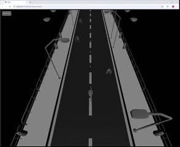

# Shadow-Zombie-Game

  
*Краткое описание того, что происходит на GIF.*

## Технологии

В проекте использовались следующие технологии:

- **Vite** — быстрый инструмент для сборки и разработки современных веб-приложений.
- **Three.js** — библиотека для работы с 3D-графикой в браузере.
- **TypeScript** — основной язык программирования.
- **HTML/CSS** — для структуры и стилизации интерфейса.

## Как запустить

   ```bash
   git clone https://github.com/MaxTube-dot/Shadow-Zombie-Game
   cd Shadow-Zombie-Game
   npm install
   npm run dev
   ```